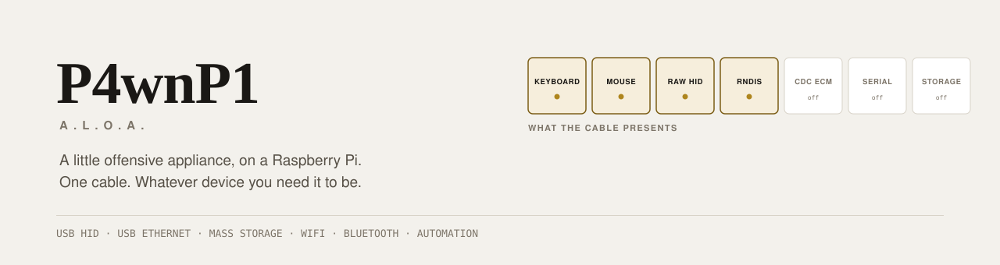
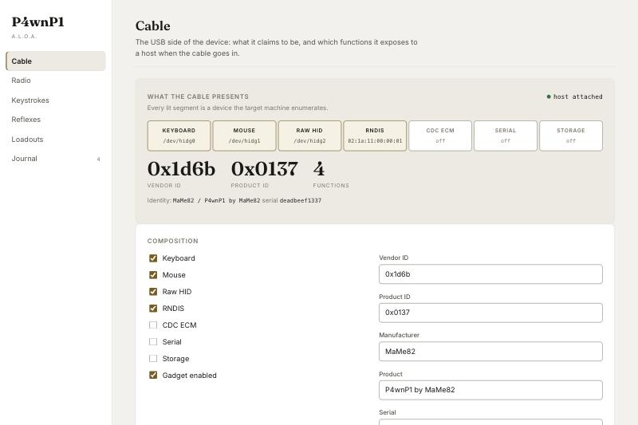
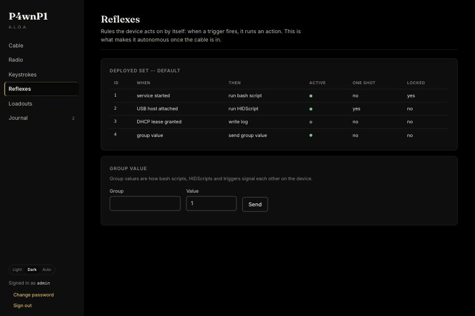
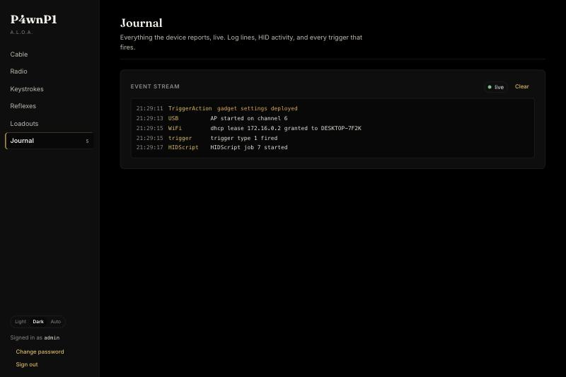

<p align="center">
  <picture>
    <source media="(prefers-color-scheme: dark)" srcset="docs/img/banner-dark.svg">
    
  </picture>
</p>

<p align="center">
  <strong>A Raspberry Pi that becomes whatever USB device the job needs.</strong><br>
  Keyboard, mouse, network adapter, mass storage, serial — alone or all at once,<br>
  reconfigurable from a browser, scriptable, and able to act on its own once the cable is in.
</p>

<p align="center">
  <a href="https://github.com/at0m-b0mb/P4wnP1_aloa/releases/latest"><strong>Download an image</strong></a>
  &nbsp;·&nbsp;
  <a href="#the-console">The console</a>
  &nbsp;·&nbsp;
  <a href="#building">Build it yourself</a>
  &nbsp;·&nbsp;
  <a href="#what-is-not-verified">What is not verified</a>
</p>

---

> **Authorized testing only.** This is a red-team tool. Point it only at systems you own or
> have written permission to test. See [DISCLAIMER.md](DISCLAIMER.md).

> **Hardware-verification status.** The images below are built from official Raspberry Pi OS
> releases and automatically verified before publishing — but **they have never been booted on
> a physical Pi.** Read [What is not verified](#what-is-not-verified) before you rely on this.

---

## Download

Built from `v0.3.1`, on **Raspberry Pi OS Lite (Debian 13 "trixie"), 2026-09-15**, kernel
`6.18.50+rpt-rpi`.

> **If you are running v0.3.0 or earlier, replace it.** Every image up to and including
> v0.3.0 shipped the same SSH password (`p4wnp1:p4wnp1`) with passwordless sudo, so anyone
> who could reach the device — including the host it was plugged into — could take root on
> it. See [KNOWN_ISSUES.md](KNOWN_ISSUES.md). v0.3.1 ships no usable account at all.

| Image | Size | Boards |
|---|---|---|
| `P4wnP1-ALOA-v0.3.1-armhf.img.xz` | 640M | Pi Zero, **Pi Zero W**, Pi 1 |
| `P4wnP1-ALOA-v0.3.1-arm64.img.xz` | 592M | **Pi Zero 2 W**, Pi 3, Pi 4, Pi 5 |

```
armhf  sha256  7c06dc881c9bb3ad09f2adaf3c4a8d5225c7004625d63a055013499987a6b901
arm64  sha256  c4c56374657febf93905ed2e25b6bf797fb92bfa6df1a9ec5da0577062295cbc
```

Verify, flash, and boot with the cable in the **data** port (the inner one on a Zero):

```bash
sha256sum -c P4wnP1-ALOA-v0.3.1-armhf.img.xz.sha256
xz -d P4wnP1-ALOA-v0.3.1-armhf.img.xz
sudo dd if=P4wnP1-ALOA-v0.3.1-armhf.img of=/dev/sdX bs=4M conv=fsync status=progress
```

**Before you flash**, set a username and password in Raspberry Pi Imager ("Set username and
password" under the gear icon). The image ships with **no usable account**, so this is how you
get in. If you skip it, boot the device once, put the card back in your laptop, and read
`p4wnp1-credentials.txt` on the boot partition — first boot generates a password for this one
device and writes it there.

Then, over the USB ethernet link the device brings up:

```bash
ssh p4wnp1@172.16.0.1                      # or the account you set at flash time
sudo cat /root/INITIAL_CREDENTIALS.txt     # console password and WiFi PSK for THIS device
```

Open **<http://172.16.0.1:8000>**.

Nothing is shared between devices: there is no password in the image at all, host keys are
generated per device, and the console password and WiFi PSK are random per device. That is why
the first login has to come over USB or serial — the WiFi key is not knowable until you have
read it off the device.

Earlier images shipped `p4wnp1:p4wnp1`. If you flashed one of those, change that password: the
forced change at first login did not protect it, because whoever logs in first is the one who
answers the prompt.

---

## The console

<p align="center">
  <picture>
    <source media="(prefers-color-scheme: dark)" srcset="docs/img/console-cable-dark.jpg">
    
  </picture>
</p>

The first thing it shows you is **what the cable presents** — a live picture of the USB functions
the machine on the other end actually enumerates, each segment carrying its device path or host
address, with the attach state driven by real gadget events.

| View | What it is |
|---|---|
| **Overview** | What the device is presenting and doing right now, and a plain-language primer if you are new to it |
| **Cable** | USB composition and the identity the device claims — vendor, product, serial |
| **Radio** | WiFi state, the Bluetooth controller, and the interface table |
| **Keystrokes** | HIDScript editor and runner, with the full function reference on the page |
| **Reflexes** | Build, arm and delete the trigger/action rules the device runs by itself |
| **Loadouts** | Whole-device configurations, backup, reboot, shutdown |
| **Journal** | Everything the device reports, live |

<p align="center">
  
  
</p>

It is built to be learnable by someone who has never used a P4wnP1. The
Overview says in plain words what the device is and what it is doing; every USB
function explains what the host will see; the HIDScript reference lists all 24
functions on the page you write scripts on, because they are injected into a
runtime VM and appear in no file you can open; and failures are translated into
what went wrong and what to do about it, with a button to the view that fixes
it, rather than showing the service's own wording.

**196KB total, no framework and no build step** — 120KB of that is two variable
webfonts, served from the device because this appliance is routinely operated with no internet
route at all. The smallest supported target is a Pi Zero W: one 1GHz ARM11 core and 512MB of
RAM. Light and dark themes, and all 18 text and UI colour pairings are checked against WCAG AA
in both by `make contrast`.

---

## What it does

| | |
|---|---|
| **USB functions** | HID keyboard, HID mouse, raw HID, RNDIS, CDC ECM, mass storage (disk or CD-ROM), serial — individually or as one composite device, reconfigurable at runtime |
| **HIDScript** | 24 functions exposed into a JavaScript VM running on the device; 15 keyboard layouts; human-cadence typing; absolute mouse positioning; LED-state branching; up to 8 parallel jobs |
| **DuckyScript** | Converts to HIDScript, 66 key names recognised |
| **Triggers** | 9 event types — USB host attach/detach, AP started, joined WiFi, SSH login, DHCP lease, GPIO, group values |
| **Control** | 82 RPCs over gRPC and JSON, plus a live event stream |

Existing DuckyScript payloads run here:

```bash
P4wnP1_cli ducky convert payload.txt -o payload.js --layout gb --speed 80 --jitter 20
```

DuckyScript 1.0 converts in full. Later Hak5 dialects and Bash Bunny directives are reported as
warnings **and** left in the output as `// UNCONVERTED:` comments — a payload that converts
cleanly while silently losing a third of its logic is worse than one that refuses.

---

## Hardware

| Board | Image | Status |
|---|---|---|
| **Pi Zero W** | `armhf` | The classic target. The only board with a Nexmon-patched firmware, so the only one where KARMA and multi-SSID can work. |
| **Pi Zero** | `armhf` | No WiFi or Bluetooth. USB surface only. |
| **Pi Zero 2 W** | `arm64` | USB, normal AP and Bluetooth all build. No Nexmon for its BCM43436, so no KARMA. |
| **Pi 3 / 4 / 5** | `arm64` | On a Pi 4/5 the USB-C port is the one that does peripheral mode. |

> Upstream and earlier versions of this README said the Pi Zero 2 W was unsupported and blamed
> the WiFi chipset. That was not the reason. The core service was gated to 32-bit ARM by build
> tags (`+build linux,arm`) that turned out to be incidental rather than a genuine dependency —
> removing them builds arm64 with no code changes. The chipset only limits KARMA, not the device.

You also need a microSD card (8GB minimum), a USB cable or OTG adapter, and ideally an external
5V supply so the Pi can stay powered while detached from the target.

---

## Building

Everything cross-compiles from macOS or Linux. No Pi required to build.

```bash
make build-armv6     # binaries for Pi Zero / Zero W
make build-arm64     # binaries for Pi Zero 2 W / 3 / 4 / 5
make image           # flashable .img.xz for both, via Docker
make test            # Go unit tests
make verify          # every gate below, in order, cheapest failure first
make smoke           # run the service in a container, end to end (28 checks)
make feature-test    # call all 83 RPCs against the real binary (85 checks)
make access-control  # attack the running service (60 checks, all must FAIL)
make check-quoting   # values install.sh writes must survive being sourced
make check-render    # render every console view in jsdom (11 checks)
make check-rpc       # console RPC payloads vs the .proto
make check-js        # parse the console JavaScript
make contrast        # WCAG check on the console palette (21 pairings x 2 themes)
make mock            # serve the console against a mock device, no Pi needed
```

To use the console yourself without a Pi, `./tools/live-console.sh` serves it from the **real
service binary** in a container on `http://127.0.0.1:8000/app/`. Hardware-backed features report
that they are unavailable, which is correct there; everything else is live. Prefer it to
`make mock`: the mock has twice disagreed with the service and hidden a bug until it shipped.

Image building is documented in **[image/README.md](image/README.md)**. Every built image is
**mounted and verified before it is published**: MBR signature, both partitions, that the
partition table fits inside the file, that both filesystems mount, the payload and the console,
that the units are enabled, that `config.txt` carries the dwc2 overlay and `cmdline.txt` loads it
as a single line, that `root=PARTUUID` still matches the disk identifier, that no SSH host keys
were baked in, and that the binaries are the right architecture. A failure refuses to publish.

That check exists because a build once produced 2.6GB of zeros, compressed it to 410KB, wrote a
checksum for it and reported success.

Installing onto a Pi you already have:

```bash
sudo ./install.sh --ssid MyAP --wifi-country GB
```

---

## Security posture

This is a tool for attacking systems, which makes its own security worth stating plainly.

- **The API authenticates.** Every gRPC method and every JSON endpoint requires a bearer token.
  Tokens are opaque, random, expire on a sliding window, and can be revoked.
- **Per-device secrets, including the SSH login.** Nothing meaningful is shared between two
  flashed devices, and the access point refuses to broadcast on a PSK published in this
  repository. The image ships with **no usable account at all** -- every password is generated
  on the device at first boot, and the image build refuses to publish an image in which any
  account has a password. Set your own at flash time (Raspberry Pi Imager's "Set username and
  password") and the device uses that; otherwise first boot writes a per-device password to
  `p4wnp1-credentials.txt` on the boot partition, where you can read it by putting the card back
  in your laptop. Log in, change it, delete the file -- the file says so itself.
- **Path handling is allowlisted**, and reads are bounds-checked. The allowlist
  resolves symlinks rather than only cleaning the string, and the file opens use
  `O_NOFOLLOW`. Both are needed: before this, a local user could leave a symlink
  in `/tmp` and have the root service write a cron job through it. The kernel's
  `fs.protected_symlinks` does not cover that case -- it only guards symlinks
  sitting directly in a sticky directory, not one level down.
- **The device is reached by IP, and says so.** A `Host` naming this device by
  a public DNS name is refused, because the origin check compares `Origin`
  against `Host` and an attacker who controls a domain controls both. An IP
  literal cannot be rebound, so the legitimate routes are unaffected.
- **Brute force is rate-limited in a way that survives parallelism.** Rejected
  logins serialise; the one-second delay used to run per-goroutine, so twenty
  simultaneous guesses cost one second rather than twenty.
- **You can see who is signed in**, and end one session without ending them
  all. The list carries no tokens, only one-way identifiers.
- **Secrets stay off command lines and out of `/tmp`.** Anything on a command
  line is in `/proc`, which every local account can read.
- **The console is same-origin only.** It emits no CORS headers and rejects foreign origins,
  because this device is often reached from a browser that is simultaneously visiting untrusted
  pages.
- **Payload text cannot become code.** The DuckyScript converter escapes its output so a crafted
  payload cannot close the generated JavaScript literal and run as root.
- **The device's own scripts hold an ordinary credential, not a back door.** `servicestart.sh`
  and your trigger actions drive the box through `P4wnP1_cli`, so they need to authenticate. At
  startup the service logs in as itself and writes that session token to
  `/run/p4wnp1/local.token` — mode `0600`, on a tmpfs, gone at power-off. It is the same kind of
  token `auth login` returns: it appears in the session list, expires on the normal schedule, and
  revoking all sessions revokes it too. There is no bypass in the token validator and no second
  credential type. Root on the device can already read the password hashes and every stored WiFi
  key, so a root-only file grants root nothing it could not already take.

**Still open:** there is no TLS. The console is served over plain HTTP, so a bearer token rides
in cleartext over whatever link you reach it on. On the device's own WPA2 access point or a USB
cable that is survivable; over anything else it is not. Treat this as a device you reach
directly, not one you expose.

---

## What is not verified

Being specific about this matters more than the feature list.

**No physical Raspberry Pi was used at any point.**

*Verified by automation.* `make smoke` runs the **real service binary against the real data
tree in a container** and checks 28 things end to end — all passing:

```
PASS  firstboot bootstrap writes auth.json 0600      PASS  login returns a token (43 chars)
PASS  service survived startup without hardware      PASS  JSON bridge exposes 82 RPCs
PASS  reached 'service initialized'                  PASS  wrong password is refused
PASS  gRPC listener up                               PASS  login without Content-Type is refused
PASS  HTTP listener up                               PASS  changepw without a token is refused
PASS  no panic in the log                            PASS  cross-origin is refused even with a token
PASS  GET / redirects to the console                 PASS  unimplemented RPC returns 501, not a corpse
PASS  the console is served                          PASS  a hostile read length is rejected
PASS  console JS is served (3 files)                 PASS  USB settings use proto field names
PASS  console CSS is served                          PASS  the device's own scripts can authenticate
PASS  console favicon is served                      PASS  the local script credential exists, root-only
PASS  unauthenticated API is refused                 PASS  P4wnP1_cli works with no interactive login
                                                     PASS  service still alive after hostile input
                                                     PASS  clean shutdown on SIGTERM
```

`make access-control` is the adversarial gate: **every check in it is an attack that must fail** --
60 of them, covering unauthenticated reach, cross-origin and DNS rebinding, path traversal on all
three folders, symlink escape, token revocation, and the machine-local credential. Most were
written by first demonstrating the attack *succeeding* against the real binary, then fixing the
code, then confirming the check flipped. That is how the symlink escape above was found: a
non-root user planted `/tmp/sub/escalate -> /etc/cron.d/pwned` and the API wrote a root-owned
cron job through it.

`make feature-test` goes a layer deeper and **calls every one of the 83 RPCs** against that same
binary, sorting the answers into passed, correctly-unavailable-without-hardware, and failed.
On a machine with no USB gadget and no WiFi: **47 passed, 32 correctly unavailable, 6 skipped,
0 failed.** The middle class is the point — it matches each failure against the exact error text
that condition should produce, so an RPC that starts failing for a *new* reason is a failure, not
a shrug. It found `StoreDeployedWifiSettings` answering `proto: Marshal called with nil` on every
board without WiFi.

That test exists because "it compiles" and "the unit tests pass" were both true the whole time
the service was panicking on every cold boot. The panic was on a success path, inside a
constructor, behind a `modprobe` that made a manual restart look healthy. Nothing short of
starting the binary would have caught it — and it caught a second one while being written.

The console has its own gates, each built after a bug got past the previous one:
`make check-rpc` compares every RPC payload the console sends against the `.proto`
(the JSON bridge discards unknown fields, so a misspelled name is silently dropped —
that produced five real bugs, one of which erased the boot configuration);
`make check-render` renders all seven views in jsdom (`node --check` only parses, and
happily accepted a helper that called itself and removed every table in the console).

Also verified: both architectures cross-compile and `go vet` is clean for both; 93 test
functions across the auth, JSON-bridge, PSK-guard and DuckyScript packages pass on linux/arm64;
images build from official Raspberry Pi OS releases and pass the mount-and-inspect check above;
and the console was driven **in a real browser against the real service binary** — sign-in, all
seven views, the live event stream, adding a reflex and reading it back off the API, both themes,
and a 375px phone viewport with no sideways page scroll.

That last one is not a formality. Driving it by hand is what found that the device could not
authenticate to *itself*: `servicestart.sh` — the fallback that brings up the USB gadget, the
DHCP servers and the access point when a startup template fails — is a shell script full of
`P4wnP1_cli` calls, and every one of them had been failing `Unauthenticated` since the API
started requiring a token. A device whose template failed came up with no network at all, and the
fallback meant to rescue it was the broken part. The console looked perfect throughout, because
the console authenticates normally. Nothing in the test suite had ever read the service's own
log; three checks now do.

*Not verified at all:* that an image boots. That USB gadget mode initialises on real silicon and
a host enumerates the functions. That keystroke injection types correctly into a real machine.
That hostapd brings up the access point. That Bluetooth pairs. That the trigger engine fires on
real events. That any of this survives having the cable pulled out mid-write.

If you are evaluating this for real work, **boot it on a Pi first and check those yourself.**
[KNOWN_ISSUES.md](KNOWN_ISSUES.md) tracks what is fixed and what is still open, including the
cold-boot panic that made every freshly flashed device dead on arrival until this release.

---

## Licence and selling this

P4wnP1 A.L.O.A. is **GPL-3.0** (see [LICENSE](LICENSE)), inherited from
[MaMe82's original](https://github.com/mame82/P4wnP1_aloa).

GPL-3.0 **permits selling** devices with this software on them. What it requires is that every
buyer gets the complete corresponding source for the version on their device, under GPL-3.0,
including your modifications, and that you do not add restrictions on their right to use, modify
and redistribute it. You cannot keep changes to this codebase proprietary while shipping them.

In practice the viable commercial shape is hardware, assembly, support, documentation, training
and engagement services — not licence fees for the code. If you intend to build a business on
this, get the position reviewed by someone qualified; the paragraph above describes what the
licence says, it is not legal advice.

---

## Documentation

- **[INSTALL.md](INSTALL.md)** — installing onto an existing Raspberry Pi OS
- **[image/README.md](image/README.md)** — building flashable images
- **[docs/TUTORIAL.md](docs/TUTORIAL.md)** — HIDScript, the CLI, and trigger actions
- **[KNOWN_ISSUES.md](KNOWN_ISSUES.md)** — the defect backlog, prioritised
- **[CHANGELOG.md](CHANGELOG.md)** — what changed and why

## Credits

Created by **[MaMe82](https://github.com/mame82)** (Marcus Mengs), whose design — the composite
gadget, HIDScript, and the trigger/action engine — is what this is. Maintained upstream at
[RoganDawes/P4wnP1_aloa](https://github.com/RoganDawes/P4wnP1_aloa). Kali Linux ship a prebuilt
image for the Pi Zero W.

This fork modernises the toolchain, adds authentication, a JSON API, arm64 support, a new
console, DuckyScript conversion and a verified image pipeline — and fixes the reason a flashed
device never worked.

<p align="center"><sub>
Fraunces for identity and figures · Inter for interface text · system monospace for measured values<br>
Warm paper with two golds; dark mode is true black
</sub></p>
